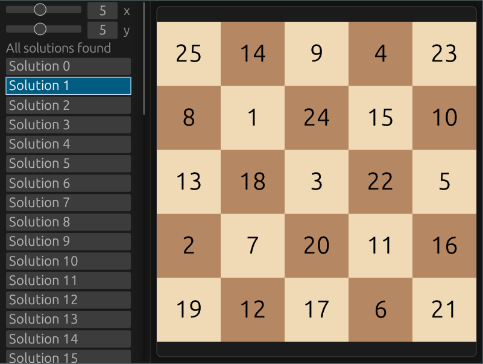

# Knight's tour demo

A knight's tour demo implemented in Rust using the egui immediate mode GUI. The goal of the knight's tour is to visit every square on the chessboard exactly once using the knight. This demo allows you to choose the starting square, the dimensions of the chessboard and presents all solutions which are computed in parallel.



# Run

```
cargo run
```
